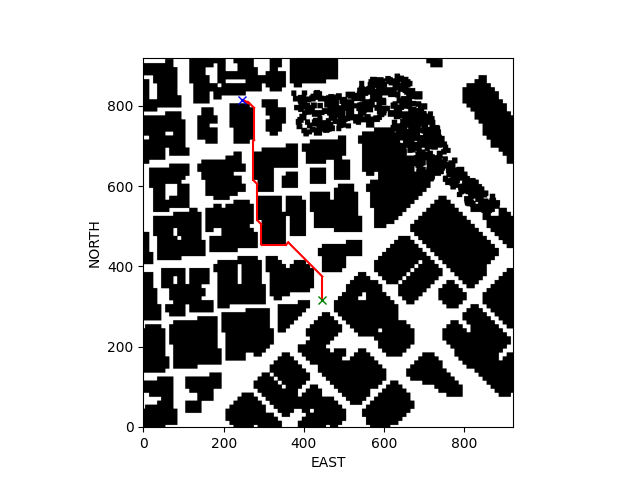
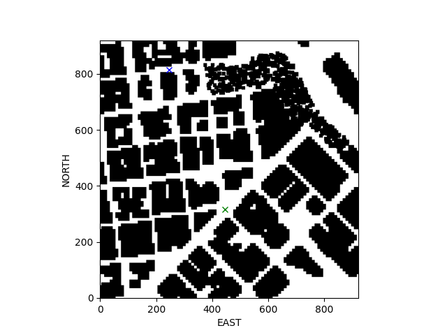

## Project: 3D Motion Planning


---


# Required Steps for a Passing Submission:
1. Load the 2.5D map in the colliders.csv file describing the environment.
2. Discretize the environment into a grid or graph representation.
3. Define the start and goal locations.
4. Perform a search using A* or other search algorithm.
5. Use a collinearity test or ray tracing method (like Bresenham) to remove unnecessary waypoints.
6. Return waypoints in local ECEF coordinates (format for `self.all_waypoints` is [N, E, altitude, heading], where the drone’s start location corresponds to [0, 0, 0, 0].
7. Write it up.

## [Rubric](https://review.udacity.com/#!/rubrics/1534/view) Points
### Here I will consider the rubric points individually and describe how I addressed each point in my implementation.  

---

### Explain the Starter Code

#### 1. Explain the functionality of what's provided in `motion_planning.py` and `planning_utils.py`
These scripts contain a basic planning implementation that includes A* path planning algorithm to find path from the drone starting point to a goal position assigned in the grid map. The grid map is loaded from `colliders.csv` file and from this file the initial poistion is retrived as well as the geodetic location of all obstacles in the grid map.

The possible actions provided in the planning algorithm are **[south, north, east, west, north_east, north_west, south_east, south_west]**. Such that the diagonal actions are given slightly higher cost than the orthogonal ones.

After finding the path connecting start and goal position, a colinearity test is executed on the whole path to eliminate unnecessary points which belongs to straight line motion in order to minimize the number of waypoints in the path.



### Implementing Your Path Planning Algorithm

#### 1. Setting global home position
I read the first line of the csv file, extract lat0 and lon0 as floating point values and use the self.set_home_position() method to set global home.

```python
with open('colliders.csv', 'r') as csv_file:
    data = list(csv.reader(csv_file))[0]
lat0 = float(data[0].split()[1])
lon0 = float(data[1].split()[1])
```

#### 2. Setting current local position
Here as long as you successfully determine your local position relative to global home you'll be all set. Explain briefly how you accomplished this in your code.

I then converted the global position to local coordinates using `global_to_local()` function provided by `udacidrone.frame_utils`

```python
north_local, east_local, _ = global_to_local(global_position, self.global_home)
```

#### 3. Setting grid start position from local position
I set a start position in the grid given the drone current local position.

```python
grid_start_north = np.ceil(north_local - north_offset)
grid_start_east = np.ceil(east_local - east_offset)
grid_start = (int(grid_start_north), int(grid_start_east))
```


#### 4. Set grid goal position from geodetic coords
After that I choose a location from the simulator as a grid goal position. First I drive the drone in simulator manually to any location of interest and then pick the (longitude, latitude) global coordinates from there and set it in the code.

```python
self.global_goal_position = np.array([-122.399684, 37.796983, 5.], dtype='Float64')

local_goal_north, local_goal_east, _ = global_to_local(self.global_goal_position, self.global_home)

grid_goal_north = np.ceil(local_goal_north - north_offset)
grid_goal_east = np.ceil(local_goal_east - east_offset)
grid_goal = (int(grid_goal_north), int(grid_goal_east))
```



#### 5. Modify A* to include diagonal motion (or replace A* altogether)
I modified the code in planning_utils() to update the A* implementation to include diagonal motions on the grid that have a cost of sqrt(2). To achieve this I updated two parts in the code. One is in the class Action which contains all possible actions the drone can do to move from cell to another cell:

```python
NORTH_WEST = (-1, -1, np.sqrt(2))
NORTH_EAST = (-1,  1, np.sqrt(2))
SOUTH_WEST = (1, -1, np.sqrt(2))
SOUTH_EAST = (1,  1, np.sqrt(2))
```

And the other change is in the function evaluating the possible actions and discards the invalid actions because of out of range or colliding with obstacles:

```python
if x - 1 < 0 or y - 1 < 0 or grid[x - 1, y - 1] == 1:   # NORTH_WEST = (-1, -1, np.sqrt(2))
    valid_actions.remove(Action.NORTH_WEST)
if x - 1 < 0 or y + 1 > m or grid[x - 1, y + 1] == 1:   # NORTH_EAST = (-1,  1, np.sqrt(2))
    valid_actions.remove(Action.NORTH_EAST)
if x + 1 > n or y - 1 < 0 or grid[x + 1, y - 1] == 1:   # SOUTH_WEST = (1, -1, np.sqrt(2))
    valid_actions.remove(Action.SOUTH_WEST)
if x + 1 > n or y + 1 > m or grid[x + 1, y + 1] == 1:   # SOUTH_EAST = (1,  1, np.sqrt(2))
    valid_actions.remove(Action.SOUTH_EAST) 
```

#### 6. Cull waypoints 
I use a collinearity test method to prune the path of unnecessary waypoints by implementing new function in [planning_utils.py](planning_utils.py).

```python
def prune_path(path, epsilon=1e-5):
    # pruned_path = []
    # for p in path:
    #     pruned_path.append(p)
    pruned_path = [p for p in path]
    index = 0

    while index < len(pruned_path)-2:
        p1 = pruned_path[index]
        p2 = pruned_path[index+1]
        p3 = pruned_path[index+2]

        collinear = check_collinearity(p1, p2, p3, epsilon)

        if collinear:
            pruned_path.remove(pruned_path[index+1])
        else:
            index += 1

    return pruned_path
```

The colinearity check is done for every 3 successive points till end of the path is reached.

The colinearity is checked by calculating the determinant of the matrix containing the 3 points parameters per row. if the determinant is below than a threshold (epsilon) then these three points are considered colinear and the middle point (p2) is eliminated from the path list. And if they are not colinear then increment the index of the start point of the sequence and do the test again and so on.

### Execute the flight
#### 1. Does it work?


### Double check that you've met specifications for each of the [rubric](https://review.udacity.com/#!/rubrics/1534/view) points.
  
# Extra Challenges: Real World Planning

For an extra challenge, consider implementing some of the techniques described in the "Real World Planning" lesson. You could try implementing a vehicle model to take dynamic constraints into account, or implement a replanning method to invoke if you get off course or encounter unexpected obstacles.


